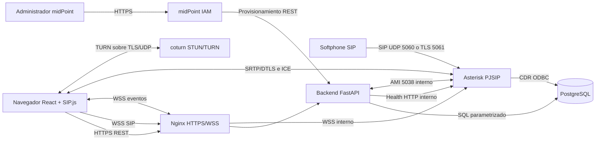

# Arquitectura de solucion

## Objetivos arquitectonicos

1. Separar telefonia, identidad, aplicacion y observabilidad por responsabilidad.
2. Permitir despliegue reproducible en una sola maquina con Docker Compose.
3. Proteger senalizacion, medios, credenciales y trazas desde el diseno.
4. Hacer verificables los requisitos mediante API, pruebas y evidencias.
5. Mantener una ruta de evolucion sin presentar el prototipo como produccion.

## Vista de contenedores

## Responsabilidades

| Componente | Responsabilidad | No responsabilidad |
|---|---|---|
| React/SIP.js | UX, registro, llamada, hold, REFER, DTMF y estadisticas RTC | Autorizar por si solo |
| FastAPI | Autenticacion, RBAC, auditoria, PDF, MOS, eventos AMI y grabaciones | Transportar RTP |
| Asterisk | PJSIP, dialplan, ConfBridge, MixMonitor, medios y CDR | Gobierno de identidades |
| midPoint | Ciclo de vida, roles y aprovisionamiento | Ser IdP OIDC del navegador |
| PostgreSQL | Persistencia transaccional, auditoria y CDR | Almacenar secretos en claro |
| Nginx | Terminacion TLS, proxy, limites y cabeceras | Logica de autorizacion |
| coturn | Conectividad ICE cuando falla el camino directo | Autenticacion de la aplicacion |

## Flujos principales

### Autenticacion y autorizacion

1. El usuario envia credenciales por HTTPS al backend.
2. El backend valida una credencial con hash resistente y emite un token corto.
3. Cada endpoint verifica token y rol; el frontend solo adapta la interfaz.
4. La auditoria registra resultado, usuario, fecha, origen y correlacion, nunca la
   contrasena ni el token completo.

### Llamada WebRTC

1. El frontend obtiene configuracion SIP autorizada sin exponer secretos ajenos.
2. SIP.js registra el agente en Asterisk mediante WSS.
3. La oferta SDP negocia Opus/PCMA/PCMU y, en video, VP8 o H.264 compatible.
4. ICE usa STUN/TURN; DTLS-SRTP protege medios WebRTC.
5. Asterisk genera CDR y el backend registra el evento de auditoria relacionado.
6. El navegador publica perdida, jitter y RTT; el backend calcula MOS acotado.
7. MixMonitor guarda audio en volumen aislado y FastAPI aplica RBAC al descargar.

### Aprovisionamiento

1. midPoint asigna uno de los roles aprobados a una identidad.
2. Un conector REST llama a un endpoint tecnico autenticado del backend.
3. El backend valida unicidad, rango de extension y autorizacion del llamador.
4. La configuracion se publica a Asterisk mediante datos realtime o artefactos
   generados y recarga controlada.
5. Se registra quien solicito, que cambio y el resultado.

## Despliegue y redes

- `edge`: solo Nginx y los puertos publicos requeridos.
- `voice`: Nginx, Asterisk y coturn.
- `application`: Nginx, backend y midPoint.
- `data`: backend, Asterisk, midPoint y PostgreSQL; no expuesta externamente.
- AMI y PostgreSQL no se publicaran al host en el perfil normal.

Los puertos SIP/RTP que requieren acceso del host se limitaran explicitamente.
Las credenciales llegaran por variables locales o secretos montados, no por la
imagen ni por Git.

## Decisiones y limites

- Un unico host Compose es apropiado para docencia y demostracion, no alta
  disponibilidad real.
- PostgreSQL puede compartir instancia en desarrollo, con bases y usuarios
  separados para aplicacion y midPoint.
- Asterisk ConfBridge opera como SFU de laboratorio para la sala 702, con
  codecs homogeneos, hasta 10 participantes y sin transcodificacion.
- H.264 queda condicionado al soporte de navegador, endpoint, perfil y licencia;
  VP8 sera la primera opcion de interoperabilidad para video WebRTC.
- ISO 27001 se usa como marco de controles; este proyecto no afirma certificacion.
